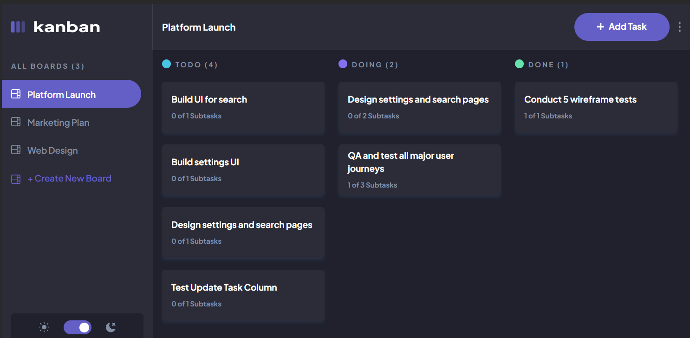

# Kanban Board

This project is a Kanban Board, meticulously crafted with the powerful combination of Next.js, TypeScript, TailwindCSS, Zustand, and custom hooks. Originally sourced from Front-End Mentor, this Kanban Board project was adopted with the primary goal of honing development skills and gaining practical experience.

As of now, this Kanban Board primarily serves personal use—a digital canvas for organizing tasks and projects. However, the project's roadmap includes plans for expansion, which will introduce user authentication features and various other enhancements in the future.

## Table of Contents

- [Getting Started](#getting-started)
- [Built With](#built-with)
- [Prerequisites](#Prerequisites)

## Screenshot




### Built with

- Semantic HTML5 markup
- Zustand
- Custom Hooks 
- Mobile-first approach
- Responsive design
- [Next JS](https://nextjs.org/) - JS library
- [TypeScript](https://www.typescriptlang.org/)
- [TailwindCSS](https://tailwindcss.com/) - For styles
- [Vercel](https://vercel.com/) - Deployment
- [API](https://github.com/HpatricioH/Kanban-task-management) - Created for this project
- "react-beautiful-dnd" for drag and drop functionality 

## Getting Started

These instructions will help you get a copy of the project up and running on your local machine for development and testing purposes.

### Installation

1. Clone the repo
   ```sh
   git clone https://github.com/HpatricioH/Kanban-task-Management-frontend.git

2. Change to the repo directory
   ```sh
   cd Kanban-task-Management-frontend

3. Install NPM packages
   ```sh
   npm install

4. Start development server
   ```sh
    npm run dev 
### Prerequisites

This project utilizes a backend API hosted in a separate repository, which can be found [here](https://github.com/HpatricioH/Kanban-task-management). At present, the API does not support user authentication features; its primary purpose has been for personal use.

### Continued development

For continued development, I will be adding more features to this project. Currently, I am working on incorporating user authentication features. Additionally, there are other parts of the project that will require refactoring, as well as the inclusion of additional features.
